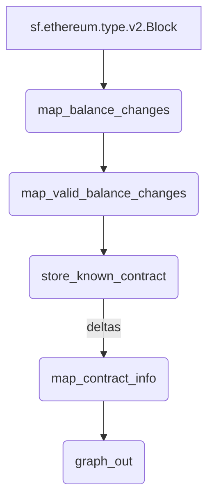

# `ERC-20` Contract info [Substreams](https://substreams.streamingfast.io)


> Extends [ERC-20 Balance Changes](https://github.com/streamingfast/substreams-erc20-balance-changes) with contract info.

## Quickstart

```
$ gh repo clone pinax-network/substreams-erc20-contract-info
$ cd substreams-erc20-contract-info
$ make
$ make gui
```

## Releases `.spkg`

- https://github.com/pinax-network/substreams-erc20-contract-info/releases

## References
- [Ethereum Docs: ERC-20 Token Standard](https://ethereum.org/en/developers/docs/standards/tokens/erc-20/)
- [EIPS: ERC-20 Token Standard ](https://eips.ethereum.org/EIPS/eip-20)
- [OpenZeppelin implementation](https://github.com/OpenZeppelin/openzeppelin-contracts/blob/9b3710465583284b8c4c5d2245749246bb2e0094/contracts/token/ERC20/ERC20.sol)
- [ConsenSys implementation](https://github.com/ConsenSys/Tokens/blob/fdf687c69d998266a95f15216b1955a4965a0a6d/contracts/eip20/EIP20.sol)

## Map Outputs

### `map_token_supply`

```json
{
  "items": [
{                                                                                               
      "address": "dac17f958d2ee523a2206206994597c13d831ec7",            
      "name":"TetherUSD",                                            "symbol":"USDT",                                                    "decimal":"6"               
    },                     
    {
      "address": "6b175474e89094c44da98b954eedeac495271d0f",
      "name":"DaiStablecoin",
      "symbol":"DAI",
      "decimal":"18"
    },             
    ...
  ]
}
```

### Mermaid graph



### Modules

```yaml
package:
  name: erc20_contract_info
  version: v0.1.0
  url: https://github.com/pinax-network/substreams-erc20-contract_info
  doc: ERC-20 Token Contract Info
----
- name: store_known_contract
    kind: store
    doc: Stores known contracts
    initialBlock: 0
    valueType : string
    updatePolicy : set_if_not_exists
    inputs:
        - map: map_valid_balance_changes

  - name: map_contract_info
    kind: map
    initialBlock: 0
    doc: Extracts ERC20 token name, symbol and decimals
    inputs:
      - store: store_known_contract
        mode: deltas
    output:
      type: proto:erc20.contract.types.v1.Infos

  - name: graph_out
    kind: map
    initialBlock: 0
    inputs:
      - map: map_contract_info
    output:
      type: proto:sf.substreams.sink.entity.v1.EntityChanges
```
