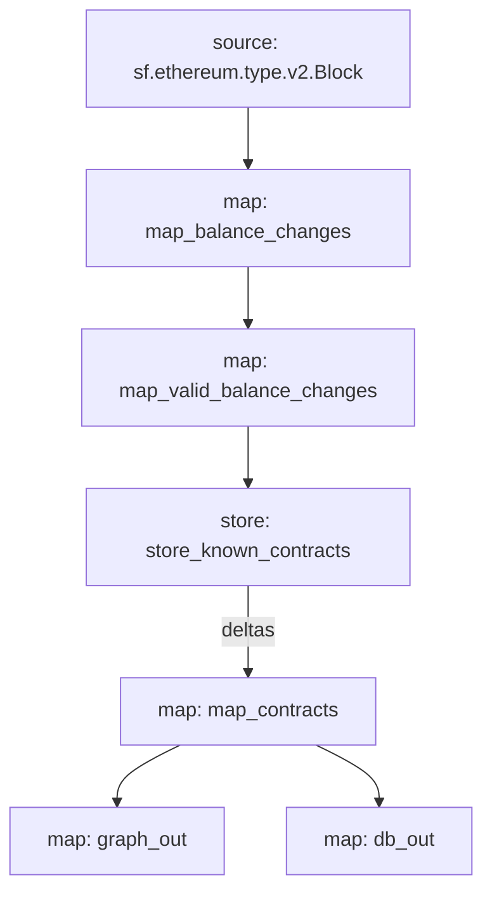

# `ERC-20` Contracts [Substreams](https://substreams.streamingfast.io)


> Extends [ERC-20 Balance Changes](https://github.com/streamingfast/substreams-erc20-balance-changes) with Token Contract information.

## Quickstart

```
$ gh repo clone pinax-network/substreams-erc20-contracts
$ cd substreams-erc20-contracts
$ make
$ make gui
```

## Releases `.spkg`

- https://github.com/pinax-network/substreams-erc20-contracts/releases

## References
- [Ethereum Docs: ERC-20 Token Standard](https://ethereum.org/en/developers/docs/standards/tokens/erc-20/)
- [EIPS: ERC-20 Token Standard ](https://eips.ethereum.org/EIPS/eip-20)
- [OpenZeppelin implementation](https://github.com/OpenZeppelin/openzeppelin-contracts/blob/9b3710465583284b8c4c5d2245749246bb2e0094/contracts/token/ERC20/ERC20.sol)
- [ConsenSys implementation](https://github.com/ConsenSys/Tokens/blob/fdf687c69d998266a95f15216b1955a4965a0a6d/contracts/eip20/EIP20.sol)

## Map Outputs

### `map_token_supply`

```json
{
  "items": [
    {
      "address": "dac17f958d2ee523a2206206994597c13d831ec7",
      "name": "TetherUSD",
      "symbol": "USDT",
      "decimals": 6
    },
    {
      "address": "6b175474e89094c44da98b954eedeac495271d0f",
      "name": "DaiStablecoin",
      "symbol": "DAI",
      "decimals": 18
    },
    ...
  ]
}
```

### Mermaid graph



### Modules

```yaml
Package name: erc20_contracts
Version: v0.1.0
Doc: ERC-20 Token Contract Info
Modules:
----
Name: store_known_contracts
Initial block: 0
Kind: store
Value Type: string
Update Policy: UPDATE_POLICY_SET_IF_NOT_EXISTS
Hash: 82f03b5fd3efbdbc65c7e5d45798405f33257815
Doc: Stores known contracts

Name: map_contracts
Initial block: 0
Kind: map
Output Type: proto:erc20.contracts.types.v1.Contracts
Hash: 5db9c17c07f9c77340123d40265899b957d69266
Doc: Extracts ERC20 token name, symbol and decimals

Name: graph_out
Initial block: 0
Kind: map
Output Type: proto:sf.substreams.sink.entity.v1.EntityChanges
Hash: f6b5404eddf524d3fb0de22ada75aae3959b33d5

Name: db_out
Initial block: 0
Kind: map
Output Type: proto:sf.substreams.database.v1.DatabaseChanges
Hash: 53b65c3f5f14d17f41dd0e0f5d0defa17d1c07a6
```
